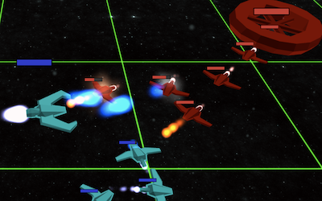

# Yet Another MOBA



It's yet another MOBA, but implemented in 13kb of (compressed) JavaScript.

## I JUST WANT TO PLAY

At the moment there's a version of the game running here: [https://js13k2021-yet-another-moba.herokuapp.com/](https://js13k2021-yet-another-moba.herokuapp.com/).
I have no idea how long this link will work. At some point in the future presume it will not, and may I at that point remember (or not) to change this link.
In which case you'll need to run a local copy, below.

### I want to see developer mode

From the main repository you'll need nodejs installed, and then you can run

```
npm install
npm run start:dev
```

And then in your browser open http://localhost:8080/ to run the game.


## BUILDING

If you actually want to be able to build the small 13k version of the code and run it in this small version, there are a few more steps. There's a pre-built version in the build/ folder you can use.

Or, you can generate it yourself, by running `python make.py`.

From here you can then go into the `build` directory and run the same npm commands.


## LICENSE

This program is free software: you can redistribute it and/or modify it under the terms of the GNU General Public License as published by the Free Software Foundation, version 3.

This program is distributed in the hope that it will be useful, but WITHOUT ANY WARRANTY; without even the implied warranty of MERCHANTABILITY or FITNESS FOR A PARTICULAR PURPOSE. See the GNU General Public License for more details.

You should have received a copy of the GNU General Public License along with this program. If not, see http://www.gnu.org/licenses/.
